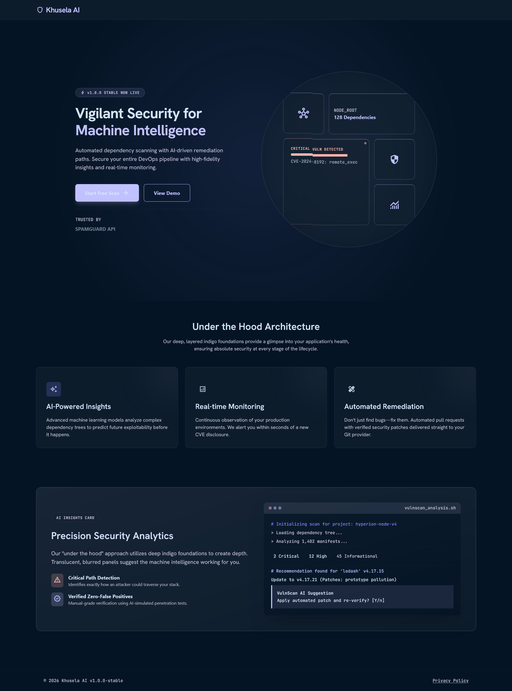
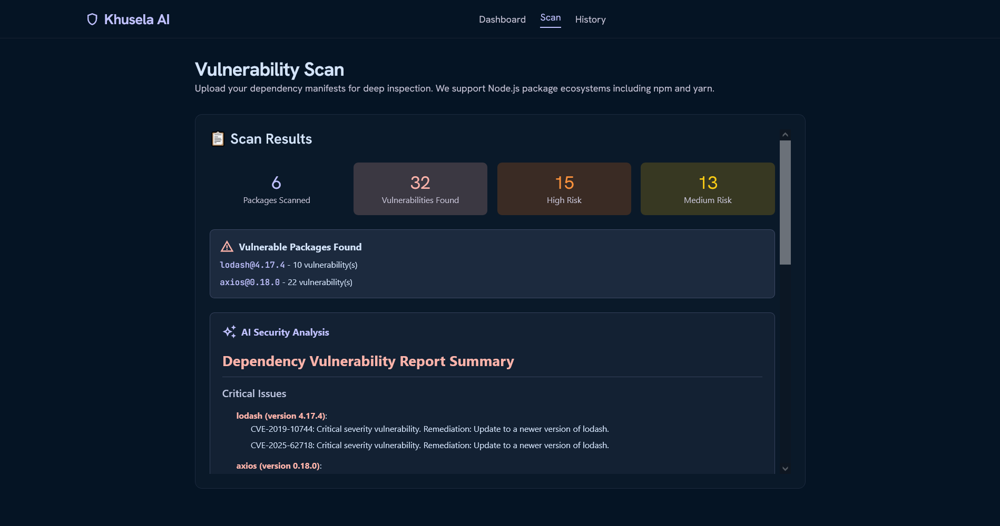
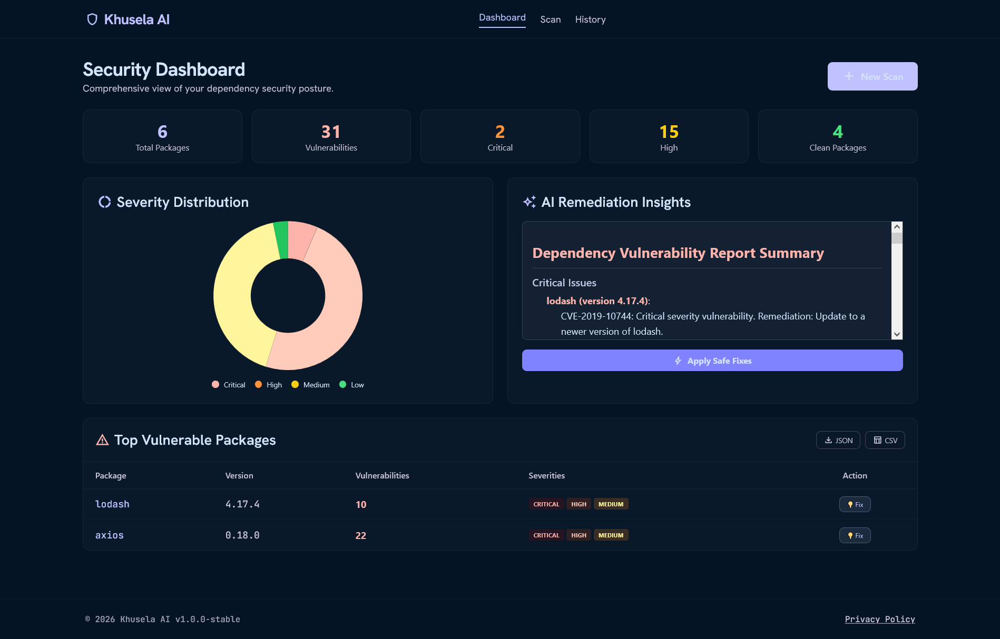
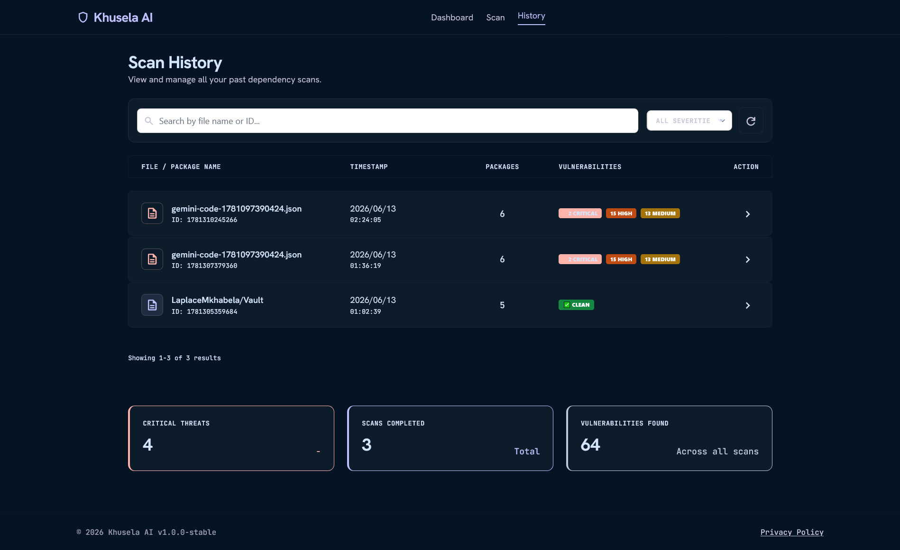

# Khusela AI - Intelligent Dependency Vulnerability Scanner

[](https://nodejs.org)
[](LICENSE)
[](http://makeapullrequest.com)

> **AI-Powered Security Scanning for Your Dependencies**

Khusela AI is a sophisticated, enterprise-grade dependency vulnerability scanner that analyzes Node.js project dependencies, checks them against the NVD (National Vulnerability Database), and provides AI-generated security reports with actionable remediation advice powered by Groq's Llama 3.1.

---

## 📸 Screenshots

### 🏠 Landing Page
*The high-impact entry point showcasing Khusela AI's capabilities and architecture*


*The landing page features a hero section with dependency visualization, bento grid showcasing key features, and AI insights preview.*

### 🔍 Scan Interface
*Streamlined drag-and-drop manifest uploader with GitHub repository support*


*Upload package.json, package-lock.json, or yarn.lock files, or connect directly to GitHub repositories for instant scanning.*

### 📊 Dashboard
*Data-rich overview with interactive charts and vulnerability inventory*


*Comprehensive dashboard featuring severity distribution charts, top vulnerable packages, AI remediation insights, and detailed vulnerability tables.*

### 📜 History Page
*Professional audit log for managing past scans*


*Complete scan history with search, filtering, pagination, and analytics cards showing critical threats and scan statistics.*

---

## ✨ Features

| Feature | Description |
|---------|-------------|
| **🤖 AI-Powered Analysis** | Groq Llama 3.1 generates human-readable security summaries with actionable recommendations |
| **📦 Multiple File Support** | Scan `package.json`, `package-lock.json`, and `yarn.lock` files |
| **🔗 GitHub Integration** | Connect directly to public GitHub repositories via HTTPS URL |
| **📊 Interactive Dashboard** | Visual charts showing vulnerability severity distribution (Critical/High/Medium/Low) |
| **💡 Smart Fix Suggestions** | AI-recommended version upgrades with copyable npm commands |
| **📜 Scan History** | Complete audit trail of all scans with search and filter capabilities |
| **📄 Export Reports** | Download results as JSON, Markdown, or CSV formats |
| **🎨 Modern UI** | Beautiful dark theme with glass-morphism effects and responsive design |
| **♿ Modal Dialogs** | Clean, non-intrusive dialogs for fix suggestions and notifications |
| **⚡ Real-time Progress** | Animated progress indicators during scan execution |
| **💾 Local Caching** | NVD API response caching to minimize rate limit issues |

---

## 🏗️ Architecture

```
┌─────────────────────────────────────────────────────────────────┐
│                         Client Browser                          │
│  ┌─────────┐ ┌─────────┐ ┌─────────┐ ┌─────────┐              │
│  │Landing  │ │  Scan   │ │Dashboard│ │ History │              │
│  │ Page    │ │  Page   │ │  Page   │ │  Page   │              │
│  └────┬────┘ └────┬────┘ └────┬────┘ └────┬────┘              │
│       │           │           │           │                    │
│       └───────────┴───────────┴───────────┘                    │
│                         │                                       │
│                    REST API Calls                               │
└─────────────────────────┼───────────────────────────────────────┘
                          │
                          ▼
┌─────────────────────────────────────────────────────────────────┐
│                      Express.js Server                          │
│  ┌─────────────────────────────────────────────────────────┐   │
│  │                    API Endpoints                         │   │
│  │  /api/analyze  │  /api/analyze-repo  │  /api/export     │   │
│  │  /api/history  │  /api/scan/:id      │  /api/fix        │   │
│  └─────────────────────────────────────────────────────────┘   │
│                          │                                       │
│         ┌────────────────┼────────────────┐                     │
│         ▼                ▼                ▼                     │
│  ┌─────────────┐  ┌─────────────┐  ┌─────────────┐             │
│  │  Scanner    │  │ Lock File   │  │  AI Agent   │             │
│  │  Module     │  │  Scanner    │  │ (Groq LLM)  │             │
│  └──────┬──────┘  └──────┬──────┘  └──────┬──────┘             │
│         │                │                │                     │
│         └────────────────┼────────────────┘                     │
│                          ▼                                       │
│                   ┌─────────────┐                               │
│                   │  NVD API    │                               │
│                   │ (CVE Data)  │                               │
│                   └─────────────┘                               │
└─────────────────────────────────────────────────────────────────┘
```

---

## 🛠️ Tech Stack

| Layer | Technology |
|-------|------------|
| **Frontend** | HTML5, CSS3, TailwindCSS, JavaScript, Chart.js, Marked.js |
| **Backend** | Node.js, Express.js |
| **AI/ML** | Groq SDK (Llama 3.1 8B) |
| **Security API** | NVD REST API v2.0 |
| **File Handling** | Multer |
| **HTTP Client** | Fetch API |
| **Cache** | Local JSON file system |

---

## 📁 Project Structure

```
vulnscan-ai/
├── server.js                 # Main Express server with API endpoints
├── package.json             # Project dependencies and scripts
├── .env                     # Environment variables
├── scanner/
│   ├── scanner.js           # package.json scanner
│   └── scanLockFile.js      # Lock file scanner (npm/yarn)
├── agents/
│   └── summarizeReport.js   # Groq AI integration for summaries
├── public/
│   ├── landing.html         # Marketing/landing page
│   ├── scan.html            # File upload & repo scan interface
│   ├── dashboard.html       # Vulnerability dashboard with charts
│   └── history.html         # Scan history with search/filter
├── cache/
│   └── nvd-cache.json       # Cached NVD API responses
├── logs/                    # Application logs
└── screenshots/             # Documentation screenshots
```

---

## 🚀 Quick Start

### Prerequisites

- Node.js 16+
- npm or yarn
- Groq API Key (free tier available)

### Installation

```bash
# Clone the repository
git clone https://github.com/LaplaceMkhabela/khusela-ai.git
cd khusela-ai

# Install dependencies
npm install

# Create required directories
mkdir -p cache logs

# Copy environment variables
cp .env.example .env

# Add your Groq API key to .env
# GROQ_API_KEY=your_key_here

# Start the server
npm start
```

### Environment Variables

Create a `.env` file in the root directory:

```env
# Groq API Configuration
GROQ_API_KEY=your_groq_api_key_here

# Server Configuration
PORT=5000
NODE_ENV=development

# NVD API Configuration (Optional - increases rate limits)
NVD_API_KEY=your_nvd_api_key_here

# Cache Configuration
CACHE_ENABLED=true
CACHE_FILE=./cache/nvd-cache.json

# Logging
LOG_LEVEL=info
LOG_DIR=./logs
```

### Running the Application

```bash
# Development mode (with auto-reload)
npm run dev

# Production mode
npm start

# Clean cache
npm run clean

# Full setup
npm run setup
```

Open your browser and navigate to:
- **Landing Page:** `http://localhost:5000/`
- **Scan Page:** `http://localhost:5000/scan`
- **Dashboard:** `http://localhost:5000/dashboard`
- **History:** `http://localhost:5000/history`

---

## 📖 Usage Guide

### 1. Scanning Local Files

1. Navigate to the **Scan** page
2. Drag & drop your `package.json`, `package-lock.json`, or `yarn.lock` file
3. Or click "Browse Files" to select from your computer
4. Watch the progress animation as VulnScan AI analyzes your dependencies
5. View results including:
   - Number of packages scanned
   - Vulnerabilities found by severity
   - AI-generated security summary
   - List of vulnerable packages with CVEs

### 2. Scanning GitHub Repositories

1. Click the **"Connect Repo"** button on the Scan page
2. Enter a public GitHub repository URL (e.g., `https://github.com/facebook/react`)
3. Optionally specify a branch name (defaults to `main`)
4. Click **"Scan Repository"**
5. VulnScan AI fetches `package.json` directly via GitHub API and analyzes it

### 3. Reviewing the Dashboard

- **Severity Distribution:** Interactive donut chart showing vulnerability breakdown
- **AI Remediation Insights:** LLM-generated security recommendations
- **Top Vulnerable Packages:** List of packages with the most issues
- **Vulnerability Inventory:** Detailed table with CVE IDs, severity, and fix actions

### 4. Exporting Reports

Click the **JSON** or **CSV** buttons on the Dashboard to export vulnerability data for integration with other tools.

### 5. Viewing Scan History

The **History** page maintains a complete audit log with:
- Search by filename or scan ID
- Filter by severity level
- Pagination for large histories
- Analytics cards with aggregate statistics

---

## 🔌 API Endpoints

| Endpoint | Method | Description |
|----------|--------|-------------|
| `/api/analyze` | POST | Upload and scan a manifest file |
| `/api/analyze-repo` | POST | Scan a public GitHub repository |
| `/api/export-report` | POST | Export report in JSON/CSV format |
| `/api/scan-history` | GET | Retrieve all scan history |
| `/api/scan/:id` | GET | Get specific scan by ID |
| `/api/fix-suggestions` | POST | Get AI-powered upgrade recommendations |

---

## 🎯 Example API Calls

### Upload a File

```bash
curl -X POST http://localhost:5000/api/analyze \
  -F "jsonFile=@package.json"
```

### Scan a Repository

```bash
curl -X POST http://localhost:5000/api/analyze-repo \
  -H "Content-Type: application/json" \
  -d '{"repoUrl": "https://github.com/expressjs/express", "branch": "master"}'
```

### Get Scan History

```bash
curl http://localhost:5000/api/scan-history
```

---

## ⚙️ Configuration Options

### Rate Limiting

The NVD API has rate limits. VulnScan AI includes:
- **6.5-second delay** between requests
- **Local caching** of results to minimize API calls
- **Optional API key** for higher rate limits (50 requests per 30 seconds)

### Cache Management

Cache files are stored in `./cache/nvd-cache.json`. To clear the cache:

```bash
npm run clean
# or
rm -rf cache/*.json
```

### Custom Port

Change the port in your `.env` file:

```env
PORT=3000
```

---

## 🤝 Contributing

Contributions are welcome! Please follow these steps:

1. Fork the repository
2. Create a feature branch (`git checkout -b feature/amazing-feature`)
3. Commit your changes (`git commit -m 'Add amazing feature'`)
4. Push to the branch (`git push origin feature/amazing-feature`)
5. Open a Pull Request

### Development Guidelines

- Follow existing code style and conventions
- Add appropriate error handling
- Update documentation for new features
- Test changes thoroughly

---

## 📝 License

This project is licensed under the MIT License - see the [LICENSE](LICENSE) file for details.

---

## 🙏 Acknowledgments

- [Groq](https://groq.com/) for providing high-performance LLM inference
- [NVD](https://nvd.nist.gov/) for comprehensive CVE database
- [TailwindCSS](https://tailwindcss.com/) for the beautiful utility-first CSS framework
- [Chart.js](https://www.chartjs.org/) for interactive data visualization


---

**Built with 🔒 by the Khusela AI Team**